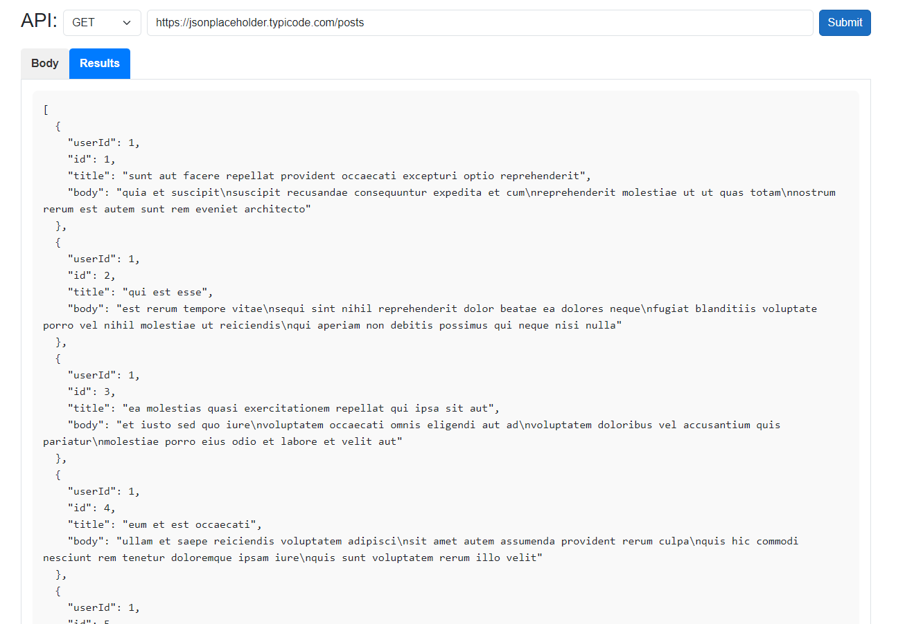
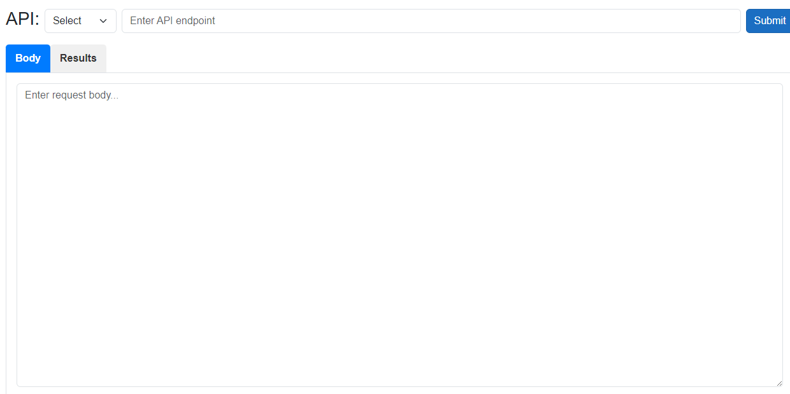

# Postman Clone
The Postman Clone application offers a clean, user-friendly interface for making API requests and viewing responses in formatted JSON. Ideal for developers and testers, it simplifies API interactions, making it easier to validate and troubleshoot API calls.

## Key Features
* User-Friendly Interface: Easy navigation for making GET requests and viewing responses.
* Formatted JSON Viewer: Read API responses in a clean, structured format.
* Debugging and Troubleshooting: Simplifies API testing for faster validation.
## Technologies Used
* C#
* .NET 8
* WinForms
* HttpClient

## How to Use the App
1. Download the executable file from the release section.
2. Launch: Start the app, and you’ll see this interface: 
 3. Make Requests: Enter your API URL and press Go to send your request. 

## Planned Features
* Additional HTTP methods: POST, PUT, PATCH, DELETE
* Support for API Headers
* Dependency Injection for flexible architecture
* Logging capabilities
* A Web-Based Interface built using Blazor WebAssembly and WPF for cross-platform compatibility
